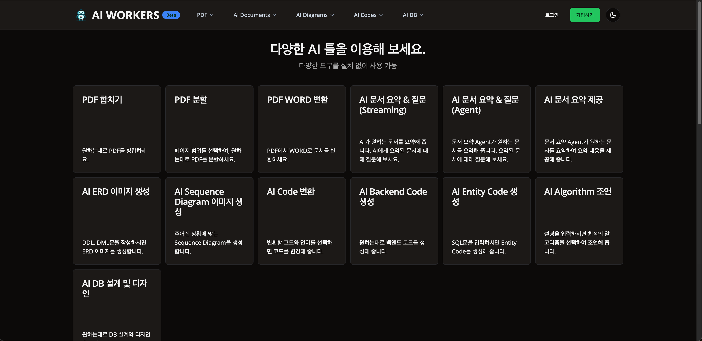

# Smart AI Workers Frontend

<div align="center">
  
</div>

[**접속 주소**](https://smartaiworkers.com/) |
[**동영상 링크**](https://vimeo.com/979660172)

## 목차

1. [기술 스택](#기술-스택)
2. [설명](#설명)
3. [설치 방법](#설치-방법)
4. [사용 방법](#사용-방법)
5. [기능](#기능)
6. [라이선스](#라이선스)

## 기술 스택

| 이름           | 기술 스택 설명                                                                     | 공식 홈페이지 링크                                         |
| -------------- | ---------------------------------------------------------------------------------- | ---------------------------------------------------------- |
| Next.js        | React 프레임워크로, 서버 사이드 렌더링과 정적 웹사이트 생성에 최적화된 도구입니다. | [Next.js](https://nextjs.org/)                             |
| Tanstack Query | React 애플리케이션에서 서버 상태 관리를 간편하게 해주는 라이브러리입니다.          | [Tanstack Query](https://tanstack.com/query)               |
| Zustand        | 작은 크기의 상태 관리 라이브러리로, React와 함께 사용됩니다.                       | [Zustand](https://zustand-demo.pmnd.rs/)                   |
| Zod            | TypeScript를 위한 스키마 선언 및 검증 라이브러리입니다.                            | [Zod](https://zod.dev/)                                    |
| TailwindCSS    | 유틸리티 기반의 CSS 프레임워크로, 빠르고 효율적인 스타일링을 가능하게 합니다.      | [TailwindCSS](https://tailwindcss.com/)                    |
| jose           | JavaScript Object Signing and Encryption 라이브러리입니다.                         | [jose](https://github.com/panva/jose)                      |
| cookies-next   | Next.js에서 쿠키를 간편하게 관리할 수 있는 라이브러리입니다.                       | [cookies-next](https://www.npmjs.com/package/cookies-next) |
| vercel/ai      | Vercel의 AI 도구 모음으로, AI 기능을 간편하게 통합할 수 있습니다.                  | [vercel/ai](https://vercel.com/docs/ai)                    |

## 설명

Smart AI Workers Frontend는 업무를 편리하게 하기 위한 AI 플랫폼입니다. 다양한 AI 기능을 제공하여 업무 효율을 극대화할 수 있습니다.

## 설치 방법

프로젝트를 설치하려면 다음 명령어를 실행하세요:

```bash
npm install
```

## 사용 방법

```bash
npm run dev
```

## 기능

- langchain과 langgraph를 이용한 Agent 구성 및 프롬프트 작성
- 코드 변환, 문서 요약 질문, ERD 생성, Sequence Diagram 생성, Backend Code 생성 기능 등 개발
- Server Sent Event로 클라이언트에 작업 알림
- Upstash-Redis로 대화 기록 저장, LLM 모델에 Context로 제공
- 모든 대화 기록 및 파일들은 3시간 이내에 삭제 기능 ([참고](https://smartaiworkers.com/ko/policies/security))

## 라이선스

이 프로젝트는 MIT 라이선스에 따라 배포됩니다.
